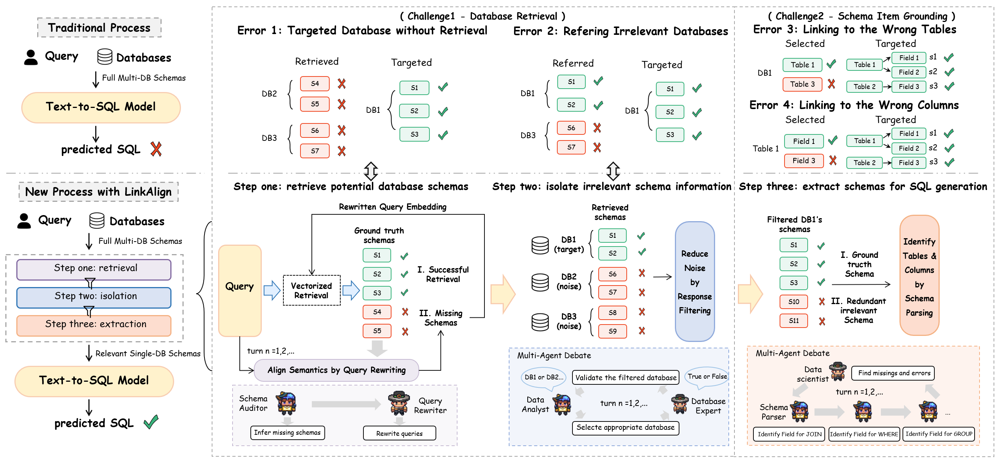

## LinkAlign: Scalable Schema Linking for Real-World Large-Scale Multi-Database Text-to-SQL

## 📘 Introduction

Schema linking is a critical bottleneck in achieving human-level performance in Text to-SQL tasks, particularly in real-world large scale multi-database scenarios. Addressing schema linking faces two major challenges: (1) Database Retrieval: selecting the correct database from a large schema pool in multi database settings, while filtering out irrele vant ones. (2) Schema Item Grounding: ac curately identifying the relevant tables and columns from within a large and redundant schema for SQL generation. To address this, we introduce LinkAlign, a novel framework that can effectively adapt existing baselines to real-world environments by systematically ad dressing schema linking. Our framework com prises three key steps: multi-round semantic enhanced retrieval and irrelevant information isolation for Challenge 1, and schema extrac tion enhancement for Challenge 2. We evalu ate our method performance of schema linking on the SPIDER and BIRD benchmarks, and the ability to adapt existing Text-to-SQL mod els to real-world environments on the SPIDER 2.0-lite benchmark. Experiments show that LinkAlign outperforms existing baselines in multi-database settings, demonstrating its effec tiveness and robustness. On the other hand, our method ranks highest among models excluding those using long chain-of-thought reasoning LLMs. This work bridges the gap between current research and real-world scenarios, pro viding a practical solution for robust and scal able schema linking. 



## ⏱️ Runtime Efficiency

We tested 75 examples randomly selected from Spider 2.0-Lite Dataset, and evaluate the **time** and **token** consumption of LinkAlign.  Please note that：

* **Excluded**: We exclude embedding and indexing time, as it varies by device and can be done before running.
* **Hyper-parameters**:  `Top-K` = 20 / `LLM` = Qwen-Turbo / `Text Embedding Model` = bge-large-en-v1.5

* **Recommendation:** Steps 1–3 decouple the `turn_n` parameter. For agent mode, it's better adjust `turn_n` in Step 1 for Retrieval Time Scaling , and setting it to 2 in Steps 2 and 3. 

| Approaches   | Step One Time (s) | Step One Token | Step Two Time (s) | Step Two Token | Step Three Time (s) | Step Three Token |
| ------------ | ----------------- | -------------- | ----------------- | -------------- | ------------------- | ---------------- |
| **Pipeline** | 9.02              | 763.79         | 2.94              | 1005.87        | 1.67                | 1560.69          |
| **Agent**    |                   |                |                   |                |                     |                  |
| Turn_n@1     | 11.95             | 1615.43        | 11.94             | 3654.81        | 10.92               | 3569.25          |
| Turn_n@2     | 23.60             | 3426.36        | 26.23             | 9270.45        | 22.24               | 8401.93          |
| Turn_n@3     | 33.44             | 5351.65        | 35.72             | 16535.32       | 30.60               | 15368.36         |
| Turn_n@4     | 50.90             | 7494.15        | 51.22             | 25148.91       | 43.91               | 23067.56         |
| Turn_n@5     | 58.42             | 9644.29        | 60.60             | 36378.40       | 52.20               | 33029.11         |

## ⚙️ Requirements

* sentence-transformers==3.0.1
* transformers==4.42.4
* torch==2.4.0
* llama-index==0.10.62
* llama-index-core==0.10.62
* llama-index-embeddings-huggingface==0.1.5
* openai==1.41.0

## 🚀 Local Deployment

We slightly modified the LlamaIndex Framework to better develop our project.

```python
# 首先进入当前虚拟环境管理的 LlamaIndex 目录
cd .../site-packages/llama_index

vim embeddings/huggingface/base.py
# 注释第 87 行 safe_serialization 参数
model = AutoModel.from_pretrained(
                model_name,
                cache_dir=cache_folder,
                trust_remote_code=trust_remote_code,
                # safe_serialization=safe_serialization,
            )

vim core/indices/vector_store/retrievers/retriever.py
# 在VectorIndexRetriever 类的 __init__ 方法中增加 self._orininal_ids 属性
self._orininal_ids = node_ids

# 增加下面三个成员方法
@property
def index(self) -> VectorStoreIndex:
    """ return object of VectorStoreIndex """
    return self._index

def change_node_ids(self, node_ids):
    ids_ = []
    if self._node_ids:
       ids_ = self._node_ids
    else:
        doc_info_dict = self._index.ref_doc_info
        for key, ref_doc_info in doc_info_dict.items():
            ids_.extend(ref_doc_info.node_ids)

        self._node_ids = [id_ for id_ in ids_ if id_ in node_ids]

def back_to_original_ids(self):
    ids_ = []
    if self._orininal_ids:
        ids_ = self._orininal_ids
    else:
        doc_info_dict = self._index.ref_doc_info
        for key, ref_doc_info in doc_info_dict.items():
            ids_.extend(ref_doc_info.node_ids)
                
    self._node_ids = ids_
```

## 📚 Citation
If you find our work useful, please cite it as:
```
@article{wang2025linkalign,
  title={LinkAlign: Scalable Schema Linking for Real-World Large-Scale Multi-Database Text-to-SQL},
  author={Wang, Yihan and Liu, Peiyu and Yang, Xin},
  journal={arXiv preprint arXiv:2503.18596},
  year={2025}
}
```
